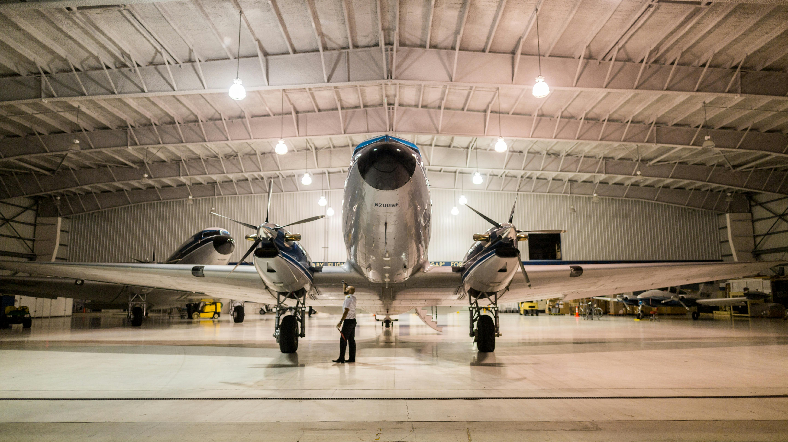

[Credit: Pexels.com](https://www.pexels.com/search/hangar/)

# Aircraft Safety Investigation

**Author: <a href="https://www.linkedin.com/in/karina-basto-eyzaguirre-203a0445/"> Karina Basto-Eyzaguirre</a>**

## Overview
This analysis has been conducted as my company has decided to diversify their business portfolio by expanding operations to the aircraft industry.

The goal of this project is to use the <a href="https://www.kaggle.com/datasets/khsamaha/aviation-accident-database-synopses">the aviation accidents data from the NTSB </a> to provide a recommendation of 'low-risk' manufacturers and models, for both commercial and private planes, for the company to purchase.

## Business Understanding
This analysis aims to identify low-risk aircrafts for a company wanting to enter the aviation industry by analyzing NTSB accident data from 1962 until 2023. The goal of this analyis is to identity risks for different aircraft manufacturers and model to be able to make a recommendation on which are the aircrafts with lowest risk to purchase within the commercial and private aircraft market.

## Data Understanding
The <a href="https://www.kaggle.com/datasets/khsamaha/aviation-accident-database-synopses"> NTSB aviation accident database </a> contains  90,348 lines of aviation accidents, and 31 columns of information, for the United States between 1962 and 2003.

This databse provides a valuable starting point for assesing aircraft safety as it provides reliable and comprehensive data on aviation accidents, including detailed information about each incident.

#### Data Limitations
The data provides a skewed view to determine airplane safety as it only contains information regarding airplane accidents. This means we get an incomplete picture and are not able to properly analyze all the risk factors associated with commercial and private planes to provide a complete recommendation of which manufacturers and model are truly low-risk.

## Data Preparation
To prepare the data for this analysis, I followed these steps:
1. Cleaned the database by removing duplicate rows, removing unnecesary columns and managing missing values. The data cleaning was necessary to avoid double counting accidents and avoid skewed results.
2. Converting columns to the correct data type.
3. Feature engineering relevant data such as creating new columns like "Uninjured Rate" and "Fatality Injury Rate" to assess aircraft safety.

To refine recommendations, I segregated the data into Commercial and Private categories due to their distinct characteristics and safety protocols. Considering the large number of manufacturers, by relying on external sources, I limited my investigation to the top market leaders in each category.

## Exploratory Data Analysis
Exploratory data analysis was conducted by leveraging accident count, "Uninjured Rate" and "Fatality Injury Rate" to determine the safest manufacturers and models for the commercial and private aircraft market. Additionally, based on the available information, I also determine the safest engine types and number of engines within an aircraft as well as looked into broad phase flight to understand if it played a role into aircraft safety.

## Conclusions
Based on EDA, the key conclusions are the following:

**Engine Type Analysis**

- For Commercial Planes, we should use Turbo Fan or Turbo Jet engines.
- For Private Planes: Reciprocating, Turbo fan and Turbo Jet engines are the best options.
  
**Number of Engines Analysis**

The conclusion is that aicraftst are safest with the following number of engines, for private planes is 1 engine and for commercial planes with 2 or 3 engines.

**Airplane Type and Aircraft Damage**

For Private Planes, the damage is either substantial or destroyed while for Commercial planes the damage is either substantial or unknown. Based on this information we can conclude that commercial planes see less aircraft damage severity as these are arger and more robust, and probably with more advanced safety features.

**Private Planes Analysis**

- Based on accident count and fatality rate the safest manufacturers are Bombardier and Dassault, with specific models: BD700, 35A, FALCON 900, and FALCON 10.
- Based on the number of engines, Bombardier's CL600, with 1 engine, is a strong recommendation.

**Commercial Planes Analysis**

- Based on accident count and fatality rate the safest manufacturer is Airbus, with models like A310, A380, AF46, A340, and A320.
- Considering the engine type and number of engines the best model is A320 with Turbo Fan Engine and 2 engines. 

**Broad Phase of Flight Analysis**

- Fatality rate vary by manufacturer and flight phase, indicating no consistent pattern.

## Recommendations
Based on the information available in the NTSB aviation accident database and the assumptions I made, I will present the following recommendations to my stakeholders:

**Private Aircrafts**

- Prioritize: Aircraft using Reciprocating, Turbo Fan, or Turbo Jet engines.
- Number of Engines: Opt for aircraft with 1 engine for the lowest fatality rates.
- Manufacturers:
1. Bombardier, specific models: 35A, BD100, and CL600.
2. Dassault, specific models: FALCON 10 and FALCON 900.

**Commercial Aircrafts**

- Prioritize: Aircraft using Turbo Fan or Tubo Jet engines.
- Number of Engines: Consider 2 or 3 engines for optimal safetys.
- Airbus is the safest option, prioritizing models: A340 and A380 due to low fatality rates and accident count as well as A320 due to its safety and market popularity.

## Next Steps 
1. Deepen Stakeholder Engagement to better understand goals, priorities and concerns to expand to the aircraft industry.

2. Expand Data Sources by exploring industry databases as well as interviewing industry experts to collect information not collected in existing databases.

3. Develop a Comprehensive Analysis and Model by incorporating more factors to identify aircraft safety and business viability (examples: aircraft type, operating environment, regulatory compliance). As well as use MLL or data mining to identify patterns and trends in the data.

#### Limitations of the analysis
1. Narrow Focus: analysis only relies on a single data source, which limits the ability to provide actionable insights for real-world decision making.
2. Oversimplified Factors: this analysis oversimplifies the factors involved in determining aircraft safety and business viability.
3. Lack of Industry context: this analysis does not consider the broader context of the aviation industry.

## For More Information:
See the full analysis in the <a href="https://github.com/KBE25/risk_analysis/blob/main/accident_analysis.ipynb">Jupyter Notebook</a>.
The business information can also be found in <a href="https://github.com/KBE25/risk_analysis/blob/main/presentation%20.pdf">this presentation </a> and this <a href="https://public.tableau.com/views/AircraftAccidentAnalysisDashboard/Dashboard1?:language=en-US&:sid=&:redirect=auth&:display_count=n&:origin=viz_share_link">Aircraft Accident Analysis Dashboard</a>.

For additional info, contact Karina Basto-Eyzaguirre at karinabastoe@gmail.com.

### Repository Structure
- <a href="https://github.com/KBE25/risk_analysis/tree/main/images"> images </a>
- <a href="https://github.com/KBE25/risk_analysis/blob/main/.gitignore"> .gitignore </a>
- <a href="https://github.com/KBE25/risk_analysis/blob/main/README.md"> README.md </a>
- <a href="https://github.com/KBE25/risk_analysis/blob/main/accident_analysis.ipynb"> accident_analysis.ipynb </a>
- <a href="https://github.com/KBE25/risk_analysis/blob/main/presentation%20.pdf"> presentation </a>

### Resources
- <a href="https://sites.lsa.umich.edu/mje/2024/05/08/comacs-impact-on-the-future-of-the-airbus-boeing-duopoly/#:~:text=For%20decades%2C%20two%20major%20firms,other%2060.4%25%20of%20the%20industry."> Comac's impact on the future of the Airbus-Boeing duopoly by the Michigan Journal of Economics </a>
- <a href="https://www.mordorintelligence.com/industry-reports/commercial-aircraft-market/market-share"> Commercial Aviation Market Share by Mordor Intelligence </a>
- <a href="https://www.kaggle.com/datasets/khsamaha/aviation-accident-database-synopses">NTSB Aviation Accident Database</a>
- <a href="https://simpleflying.com/top-5-private-jet-manufacturers-market-share-usa/"> Top 5 Jet Manufacturers in the US by Simple Flying </a>
- <a href="https://www.forbes.com/sites/geoffwhitmore/2019/08/16/what-is-the-safest-airplane-to-fly/"> What is th safest airplane to fly? by Forbes</a>